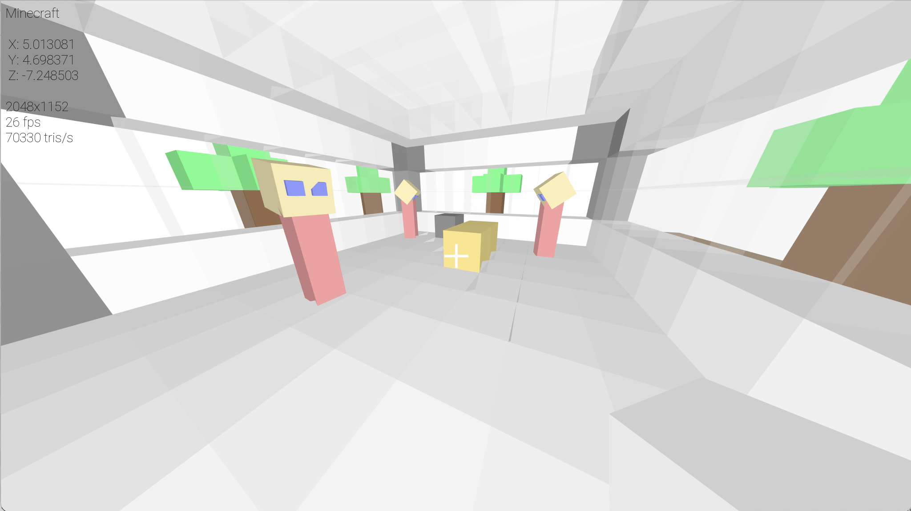
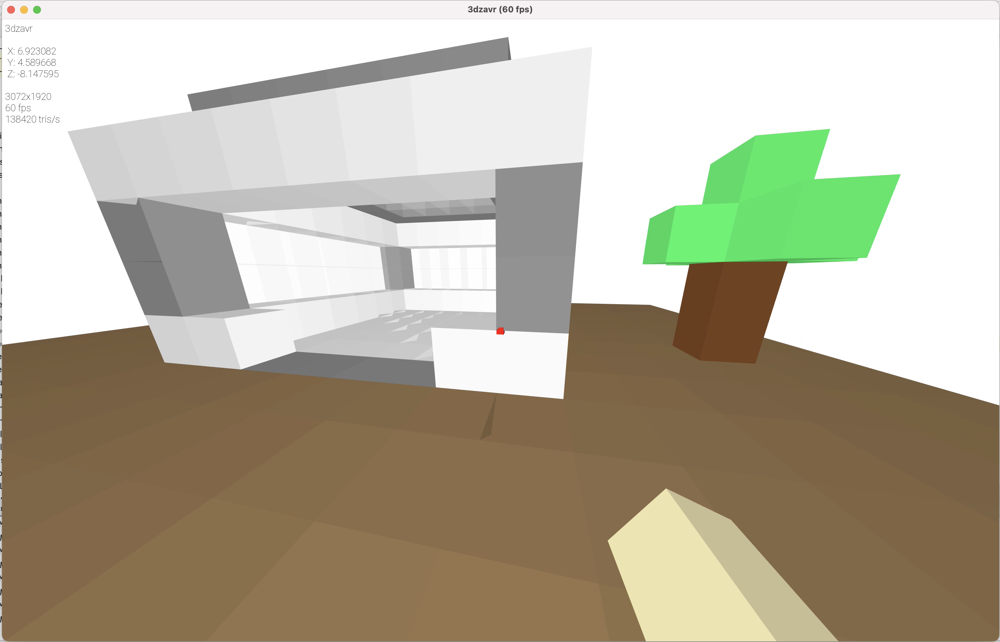
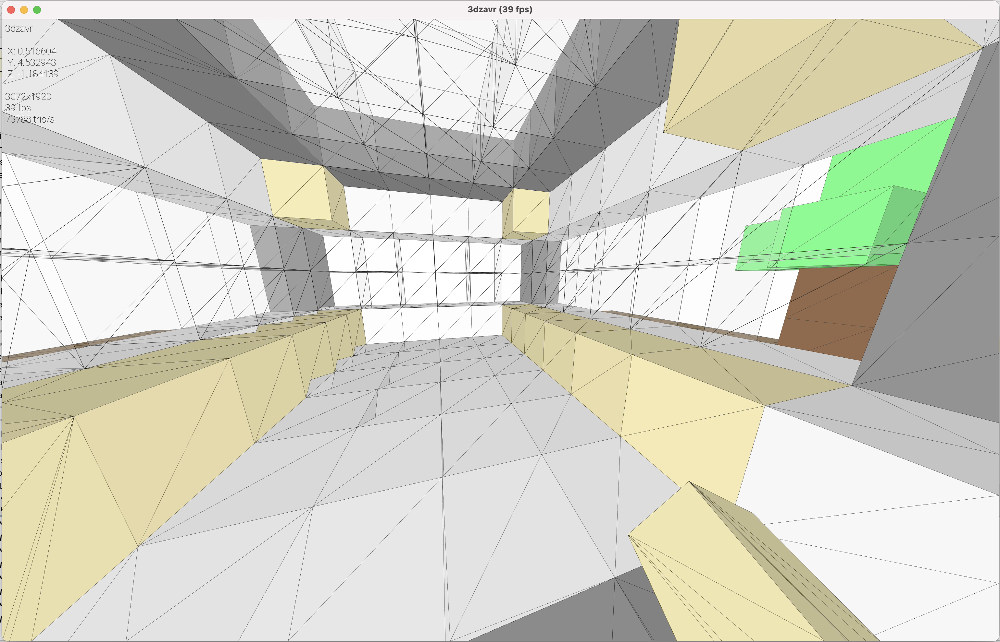
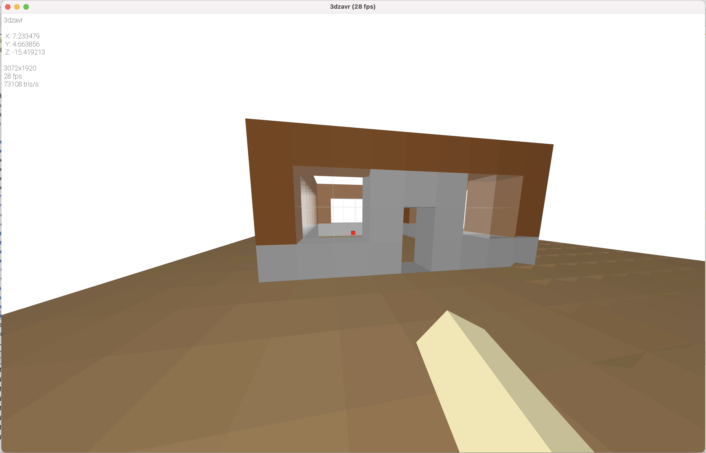
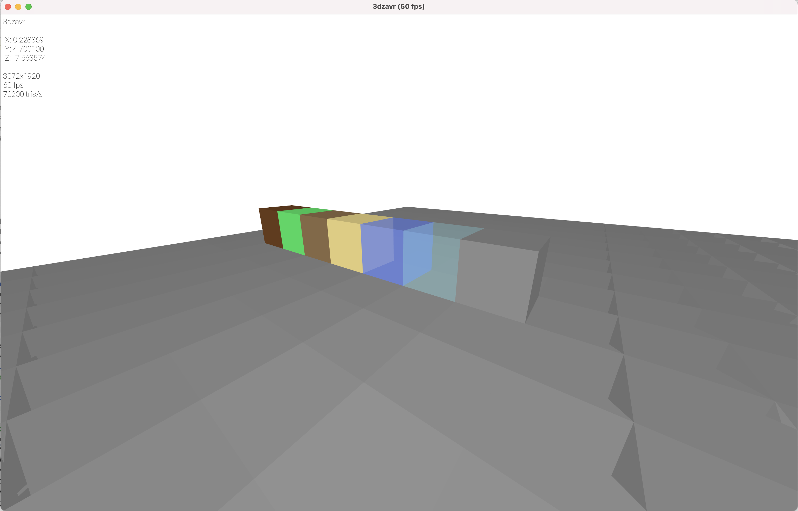

# Minecraft using 3dzavr

<h4>About:</h4>

Simple implementation of game [Minecraft](https://www.minecraft.net/) using [3dzavr](https://github.com/vectozavr/3dzavr)

<h4>Installation (OS Windows):</h4>
1) Download minecraft.7z, [unzip it](https://www.7-zip.org/) and run minecraft.exe

2) Write <b>ip</b> and <b>port</b> of server in <b>connect.txt</b> file.

3) Write <b>port</b> of the server in <b>server.txt</b> file (only for computer where the server will be running).

3) Enjoy gaming!

<h4>Control:</h4>

<b>Mouse</b>, <b>Space</b>, <b>A</b>, <b>S</b>, <b>W</b>, <b>D</b> – player control.

keys <b> <- -> </b> – change cube type

<b>O</b> – turn OpenGL on/off

<b>Tab</b> – turn debug mode on/off

<h4>Playing with a source code:</h4>

1) Download and install OpenAL library for SFML sound support (in current version you can't setup this engine without OpenAL)
   
    openal: https://openal.org/downloads/
   

2) Install SFML on your computer (<b>The compiler versions have to match 100%</b>):
   
    sfml: https://www.sfml-dev.org/download.php
   

2) Open CLion or Visual Studio
   
   CLion (recommended): https://www.jetbrains.com/clion/
   
   Visual Studio: https://visualstudio.microsoft.com/ru/
   

3) Clone this repository
   
    rep url: https://github.com/vectozavr/minecraft_3dzavr
   

4) Built project

For any issues, please, create new issue in this repository.

Demos:

Building:

There are 6 types of camera mode:

Another building

Cubes:

